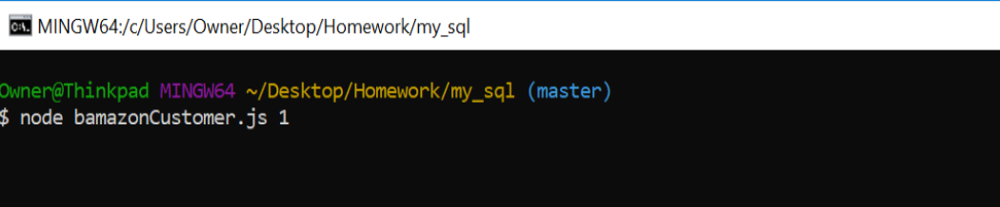
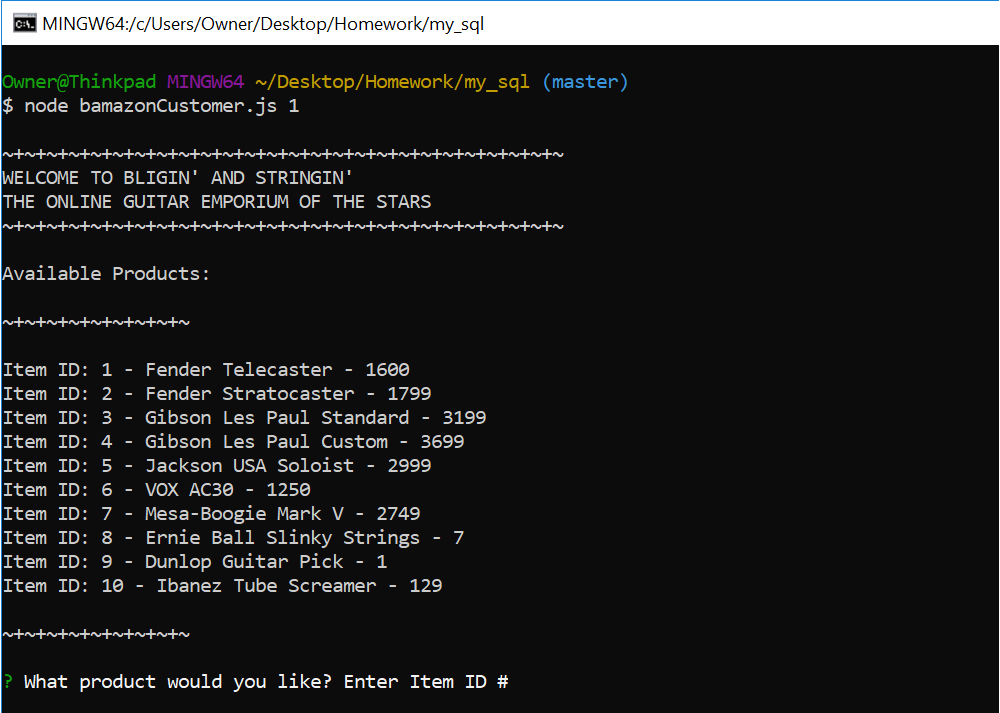
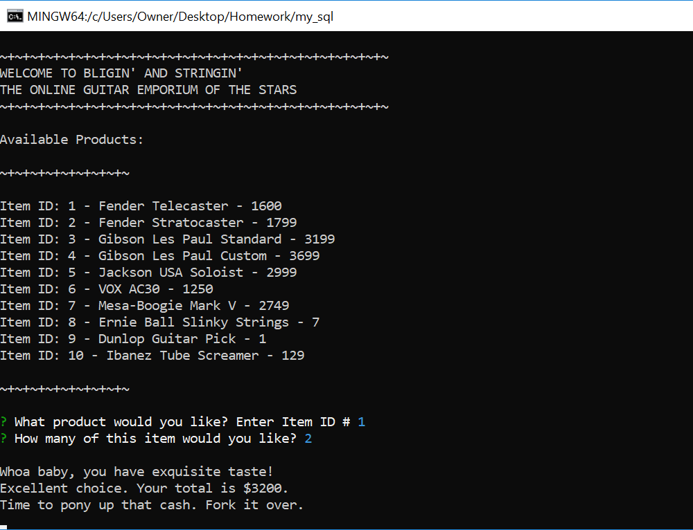

Thank you for choosing Bamazon.
This app is an online marketplace, in this case, a guitar store.
In this file, we will briefly go over how to use the interface.

1. In your CLI, enter the command "node bamazonCustomer.js"

2. You will be presented with the virtual storefront. Review the items for sale, and follow the onscreen
    questions to select item and quantity.

3. Once you've made your selection, the friendly virtual salesperson will present your total. Easy!

